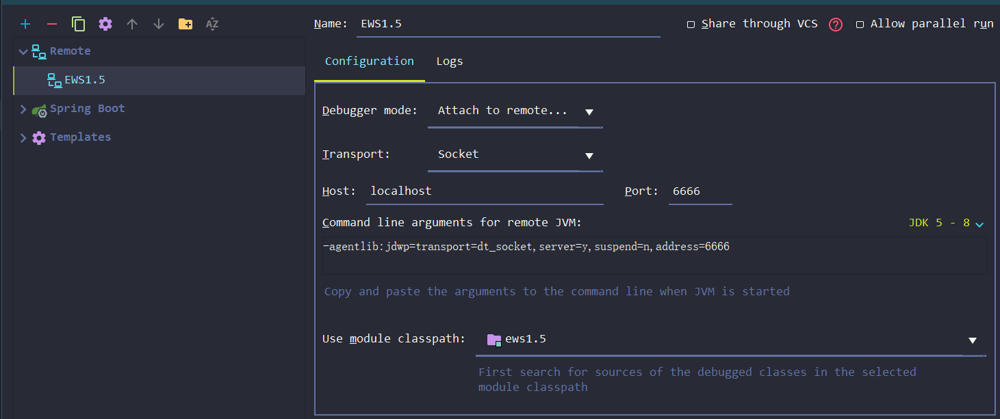

## JAVA

---

### 远程调试
1. 启动：java -jar -Dfile.encoding=UTF8 -Xdebug -Xrunjdwp:transport=dt_socket,server=y,suspend=n,address=6666 ews1.5-0.0.1-SNAPSHOT.jar
2. 配置IDE，增加Remote：
```
Debugger Mode: Attach to remote JVM
Transport: Socket
Host: [服务IP]
Port: [第一步中启动打开的调试端口]
```

### 打印GC日志
```
-Xloggc:[文件地址]
```

### 内存溢出快照
```
-XX:+HeapDumpOnOutOfMemoryError -XX:HeapDumpPath=[保存dump文件夹]
```
内存溢出后会生成pid.hprof文件，下载[mat](https://www.eclipse.org/mat/downloads.php)分析